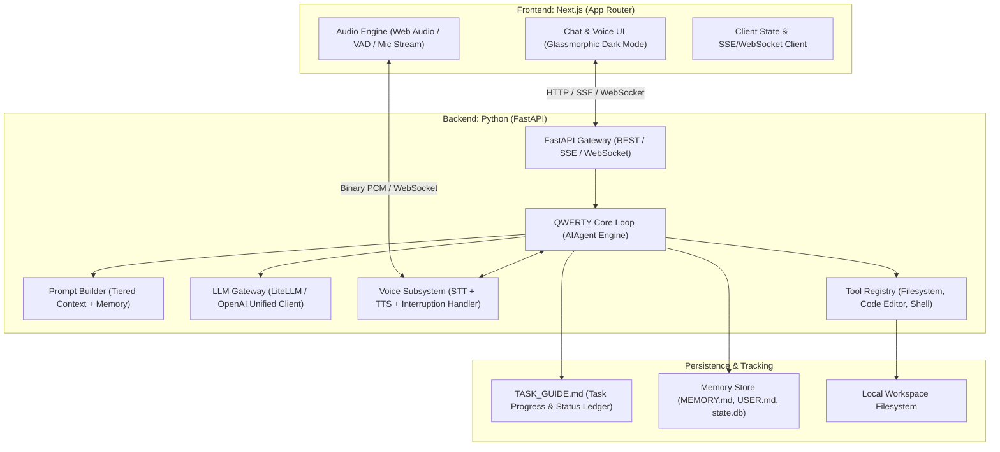

# Product Requirements Document (PRD)
## Project: QWERTY — Autonomous Conversational & Voice-Enabled AI Agent

**Document Version:** 1.0.0  
**Status:** Draft / Approved for Milestone 1  
**Author:** Pair Programming Agent & User  
**Target Environment:** Windows 11 | Antigravity IDE & VS Code  
**Architecture Reference:** [Hermes Agent Architecture (Nous Research)](https://hermes-agent.nousresearch.com/docs/developer-guide/architecture)

---

## 1. Executive Summary & Vision

### 1.1 Product Vision
**QWERTY** is an extensible, voice-first, and tool-augmented autonomous AI assistant modeled after the architecture of Nous Research's **Hermes Agent**. QWERTY acts not just as a conversational chatbot, but as a persistent, proactive pair-programming and operating companion. 

She possesses a distinct persona (female assistant, articulate, technically proficient, adaptive) and transitions across three planned evolutionary milestones:
1. **Milestone 1 (MVP):** Text-based conversational core with unified LLM routing, session state, and modern UI.
2. **Milestone 2:** Full-duplex natural voice interaction with ultra-low latency, speech-to-text (STT), text-to-speech (TTS), and real-time interruption handling (barge-in).
3. **Milestone 3:** Autonomous tool execution via voice and text, starting with local filesystem manipulation (folder creation, file reading/editing, code modifications) with safety constraints.

### 1.2 Core Architectural Inspiration: Hermes Agent
From the Hermes Agent architectural design, QWERTY adopts:
* **The AIAgent Core Loop:** A decoupled central execution loop managing provider selection, context assembly, tool dispatching, and error resilience.
* **Tiered Context & Memory:** Separation of static agent identity/system instructions, persistent durable memory (`MEMORY.md` & `USER.md`), and volatile session history.
* **Modular Tool Registry:** Dynamic tool discovery and dispatch with structured JSON schema definitions, decoupling tools from the core loop.
* **Dual-Head Gateway:** A single core backend engine capable of serving multiple user interfaces (Web UI, WebSocket voice stream, CLI, and IDE sidecars).

---

## 2. Personas & Target Users

### 2.1 Agent Persona: "QWERTY"
* **Name:** QWERTY
* **Gender/Voice Identity:** Female (warm, crisp, intelligent, professional yet friendly)
* **Role:** AI software engineer, system operator, and collaborative partner
* **Behavior:** Proactive, concise in conversation, rigorous in code modifications, asks clarifying questions when ambiguous, always reports actions clearly.

### 2.2 Developer Profile
* **Developer/User:** Working on Windows with both **Antigravity IDE** and **VS Code**.
* **Primary Workflows:** Conversational brainstorming, rapid code generation, hands-free voice commands while coding, autonomous workspace management.

---

## 3. Technology Stack & Design Decisions

### 3.1 Architecture Overview Diagram



### 3.2 Backend Tech Stack
* **Language & Runtime:** Python 3.11+
* **Framework:** **FastAPI** + **Uvicorn** (Asynchronous, high performance, native support for SSE and WebSockets).
* **LLM Client / SDK Decision:** **LiteLLM + OpenAI Python SDK standard interface**.
  * *Rationale:* Instead of coupling directly to vendor-specific SDKs (e.g. raw Anthropic or Google-only SDKs), **LiteLLM** provides a single, unified client interface supporting 100+ LLMs (OpenAI GPT-4o, Anthropic Claude 3.5 Sonnet, Google Gemini 2.0 / 1.5 Pro, Groq Llama 3, DeepSeek, and local Ollama) using standard OpenAI-compatible message formats. It allows instant swapping of models via `.env` without modifying a single line of backend logic.
* **Environment & Config:** `pydantic-settings`, `python-dotenv`.
* **State & Persistence:** SQLite (`state.db`) for chat session history + local markdown files (`MEMORY.md`, `USER.md`).

### 3.3 Frontend Tech Stack
* **Framework:** **Next.js 14+ (App Router)** + React 19 / TypeScript.
* **Styling:** **Vanilla CSS / Modern CSS Modules** with sleek glassmorphism, tailored dark mode (deep obsidian/slate, neon purple/cyan accents), and responsive layouts.
* **State & Networking:** TanStack Query / native React Hooks, Server-Sent Events (SSE) reader for streaming text, WebSocket client for real-time audio.
* **Audio Processing:** Web Audio API, AudioWorklet for low-latency PCM streaming, client-side Voice Activity Detection (VAD).

### 3.4 Dual-IDE Compatibility (Antigravity IDE & VS Code)
* Shared Python Virtual Environment (`.venv` at workspace root).
* `.vscode/settings.json` and `.vscode/launch.json` configured for unified debugging of both FastAPI and Next.js.
* Standardized script runners (`scripts/dev_backend.bat`, `scripts/dev_frontend.bat`).

---

## 4. The Guide File System (`TASK_GUIDE.md`)

A critical requirement is that the user must always have 100% visibility into what tasks the agent performed, what is currently running, and what milestone is active.

### 4.1 Specification
* **Filename:** `TASK_GUIDE.md` (located at the root of the workspace).
* **Role:** The single source of truth for execution status, task logs, completed deliverables, and upcoming steps.
* **Update Policy:**
  1. **Before Starting a Task:** The agent registers the active task under `## Current Active Task` with timestamp and planned actions.
  2. **During Execution:** Milestones, sub-steps, and any encountered blockers are recorded.
  3. **Upon Completion:** The task is moved to `## Task History` with details on files changed, verification results, and next actions.
* **Structure Template:**
  ```markdown
  # QWERTY Project Status & Task Guide
  Last Updated: YYYY-MM-DD HH:MM:SS
  Current Milestone: [Milestone 1 / 2 / 3]
  System Health: [Ready / In Progress / Blocked]

  ## Active Task
  - **Task Name:** ...
  - **Status:** [In Progress / Testing / Done]
  - **Started At:** ...
  - **Steps Planned:** ...

  ## Milestone Roadmap & Checklist
  - [x] Milestone 1: Core Conversational MVP
  - [ ] Milestone 2: Natural Voice & Interruptions
  - [ ] Milestone 3: Agentic Tools (Filesystem & Code Edit)

  ## Task Execution History
  | Date/Time | Task Description | Status | Files Modified | Notes |
  |---|---|---|---|---|
  | ... | ... | ... | ... | ... |
  ```

---

## 5. Milestone Breakdown & Detailed Specifications

### Milestone 1: Conversational Core (MVP) — "Talk to QWERTY"
> **Objective:** Establish the foundational backend, frontend, and LLM communication loop allowing the user to have a fluid, streaming conversation with "QWERTY".

#### Functional Requirements:
1. **Agent Persona Injection:**
   * System prompt defined in `backend/app/prompts/system.py` embedding QWERTY's identity, female tone, technical background, and concise communication style.
2. **LLM Provider Integration:**
   * Secure API key ingestion via `.env` (supports `OPENAI_API_KEY`, `GEMINI_API_KEY`, `ANTHROPIC_API_KEY`, or `GROQ_API_KEY`).
   * Fallback model support (e.g. primary: Claude 3.5 Sonnet / GPT-4o, fallback: Groq / Gemini 1.5 Flash).
3. **Streaming Chat Endpoint:**
   * `POST /api/chat`: Accepts user message and session ID; returns Server-Sent Events (SSE) token-by-token.
   * Session state stored in memory and persisted to SQLite.
4. **Next.js Web Interface:**
   * Minimal, ultra-clean, modern dark UI.
   * QWERTY greeting, conversation feed, auto-scrolling, syntax-highlighted code blocks, copy buttons.
   * Visual indicator of QWERTY's status ("Thinking", "Typing", "Ready").
5. **Dual IDE Setup:**
   * VS Code / Antigravity workspace configuration with launcher configs.

---

### Milestone 2: Natural Voice Interaction & Interruptibility
> **Objective:** Enable natural hands-free voice dialogue with QWERTY, featuring sub-second latency and realistic interruption handling (barge-in).

#### Functional Requirements:
1. **Speech-to-Text (STT) Subsystem:**
   * Fast streaming speech recognition.
   * *Recommended stack:* **Deepgram Nova-2** (via WebSocket, ~150ms latency) OR **OpenAI Whisper Live** / local whisper.cpp.
2. **Text-to-Speech (TTS) Subsystem:**
   * High quality, natural-sounding female voice model.
   * *Recommended stack:* **Cartesia Sonic** (fastest streaming TTS, ~90ms TTFB) OR **ElevenLabs Turbo v2.5** OR **Kokoro-82M / Edge-TTS** (free local alternative).
3. **Interruption Handling (Barge-in / VAD):**
   * Client-side Voice Activity Detection using **Silero VAD** or Web Audio API power analysis.
   * If the user speaks while QWERTY is producing speech:
     1. Client immediately halts local audio playback buffer.
     2. Client emits a `cancel` frame over the WebSocket.
     3. Backend cancels active TTS streaming and LLM generation.
     4. Backend trims the agent's response to what was actually spoken before the interruption and awaits new user voice input.
4. **Voice UI:**
   * Audio visualizer component (pulsing organic sphere or sound wave bars) indicating listening, speaking, and interrupted states.

---

### Milestone 3: Agentic Tools — Voice-Driven Filesystem & Code Editing
> **Objective:** Empower QWERTY to take autonomous actions in the user's workspace upon voice or text command.

#### Functional Requirements:
1. **Hermes-Style Tool Registry:**
   * Tool definitions complying with OpenAI tool-calling / function-calling schema.
   * Dynamic registration of tools into the `AIAgent` loop.
2. **Core Tool Suite:**
   * `create_directory(path: str)`: Creates nested directories safely within allowed workspace roots.
   * `create_file(path: str, content: str)`: Creates a new file with specified content.
   * `read_file(path: str, start_line: int, end_line: int)`: Reads code or configuration files.
   * `edit_code_file(path: str, target_snippet: str, replacement_snippet: str)`: Precise contiguous code replacement.
   * `list_directory(path: str, recursive: bool)`: Inspects workspace structure.
3. **Voice Command Orchestration:**
   * User can speak: *"QWERTY, create a new folder called services and inside it create an auth.py file"*
   * LLM parses voice transcript into tool calls, executes them via the Tool Registry, verifies the outcome, and replies via voice: *"Done. I've created the services folder and initialized auth.py for you."*
4. **Safety & Guardrails:**
   * Workspace path sandboxing: All file/folder operations restricted to defined workspace directory (prevent unauthorized system directory access).
   * Voice confirmation guardrail for destructive actions (deletions or large overwrites).

---

## 6. Architecture Breakdown & Project Directory Structure

```
d:/Projects/QWERTY/
├── PRD.md                          # This Product Requirements Document
├── TASK_GUIDE.md                   # Live task tracking & execution ledger
├── README.md                       # Project overview & quickstart
├── .gitignore                      # Git ignore for Python, Node, env, SQLite
├── .env.example                    # Template for API keys & configs
│
├── .vscode/                        # Dual IDE configuration
│   ├── launch.json                 # Launch configs for FastAPI and Next.js
│   ├── tasks.json                  # Background tasks (start backend/frontend)
│   └── settings.json               # Python interpreter & formatter settings
│
├── backend/                        # Python FastAPI Backend
│   ├── requirements.txt            # Python dependencies (fastapi, litellm, uvicorn, etc.)
│   ├── run.py                      # Backend entrypoint
│   └── app/
│       ├── __init__.py
│       ├── config.py               # Settings & environment validation
│       ├── core/
│       │   ├── agent.py            # Hermes-inspired AIAgent execution loop
│       │   ├── prompt_builder.py   # System prompt and memory assembler
│       │   └── session.py          # Session and conversation state
│       ├── prompts/
│       │   └── system.py           # QWERTY persona definition & instructions
│       ├── api/
│       │   ├── router.py           # API route registration
│       │   └── endpoints/
│       │       ├── chat.py         # SSE streaming chat endpoint
│       │       ├── voice.py        # WebSocket voice streaming (Milestone 2)
│       │       └── health.py       # Health check & system info
│       ├── tools/                  # Tool Registry (Milestone 3)
│       │   ├── base.py             # Tool base class & schema generator
│       │   ├── registry.py         # Tool registry and dispatcher
│       │   └── filesystem.py       # File and folder operations
│       └── services/
│           ├── llm.py              # LiteLLM client wrapper
│           ├── stt.py              # Speech-to-Text service (Milestone 2)
│           └── tts.py              # Text-to-Speech service (Milestone 2)
│
├── frontend/                       # Next.js Application
│   ├── package.json
│   ├── tsconfig.json
│   ├── next.config.js
│   └── src/
│       ├── app/
│       │   ├── layout.tsx          # Root layout with fonts & metadata
│       │   ├── page.tsx            # Main QWERTY interface
│       │   └── globals.css         # Design system, variables, animations
│       ├── components/
│       │   ├── ChatContainer.tsx   # Message feed & auto-scroll
│       │   ├── MessageBubble.tsx   # Markdown & code rendering
│       │   ├── InputBar.tsx        # Text input & send button
│       │   ├── VoiceVisualizer.tsx # Audio pulse / status orb (Milestone 2)
│       │   └── ToolActivity.tsx    # Live tool execution card (Milestone 3)
│       ├── hooks/
│       │   ├── useChat.ts          # SSE chat management hook
│       │   └── useVoice.ts         # Voice recording, VAD & playback hook
│       └── lib/
│           ├── api.ts              # Backend API client
│           └── audio.ts            # Web Audio & VAD helpers
│
└── storage/                        # Persistent Agent Memory & Sessions
    ├── MEMORY.md                   # Long-term durable memory
    ├── USER.md                     # User preferences & profile
    └── state.db                    # SQLite conversation history
```

---

## 7. Implementation Plan & Deliverables Roadmap

| Phase | Target Date | Deliverables | Success Criteria |
|---|---|---|---|
| **Phase 0** | Immediate | `PRD.md`, `TASK_GUIDE.md`, project scaffold | Project docs and guide approved and tracked |
| **Milestone 1** | Next | Backend FastAPI + LiteLLM + Next.js chat UI | User talks to QWERTY via text with streaming responses |
| **Milestone 2** | Follow-up | STT + TTS + Interruption WebSocket pipeline | Hands-free natural voice conversation with barge-in |
| **Milestone 3** | Follow-up | Tool Registry + Filesystem operations (voice/text) | QWERTY creates folders and edits code upon command |

---

## 8. Risk Analysis & Mitigation Strategies

| Risk | Impact | Mitigation |
|---|---|---|
| **LLM Provider Rate Limits or Outages** | High | LiteLLM multi-provider fallback routing (e.g. fallback from OpenAI to Groq or Anthropic). |
| **High Voice Latency** | Medium | Use streaming chunked audio over WebSockets + ultra-low latency providers (Deepgram + Cartesia). |
| **Audio Interruption Glitches** | Medium | Client-side VAD with immediate local audio buffer clearing and server cancellation token. |
| **Accidental File Overwrite** | High | Strict workspace path validation; create backup copies before in-place code editing. |
